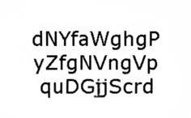
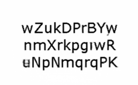

# Authors

Daniël M. Pelt, LIACS, Leiden University, Leiden, The Netherlands

# Brief description

This is a submission to the Helsinki Deblur Challenge 2021 ([link](http://fips.fi/HDC2021.php)). The approach uses Mixed-Scale Dense CNNs [1] ([link](https://www.pnas.org/content/115/2/254.short)) to deconvolve images of text. A seperate set of networks is trained for each blur category, but for all categories the used networks and training approaches are identical. A multi-scale approach is used, in which five networks are trained for each blur category: first, a network is trained at 20x downscaled images, then, a network is trained at 10x downscaled images, and at 4x, 2x, and no downscaling afterwards. At each scale, an upscaled version of the network output of the previous scale is used as additional input. 

The key to improving results for large blur categories was to create a large set of simulated training images using the provided images for other blur levels. So for each blur category, we first trained a multi-scale set of five networks to simulate the blurring by using as input thresholded CAM01 images, and as target the CAM02 images for that blur level. The trained networks were then applied to the 3800 thresholded CAM01 images of all other blur levels, to produce 'virtual CAM02' images. A new multi-scale set of five networks was then trained using the virtual CAM02 images as input, and the thresholded CAM01 images as target, to produce a deconvolving method. The provided CAM02 images were used as a validation set to monitor network performance during training. As described above, this same procedure was used for all blur categories (although for smaller blur categories it is possible to train with only the provided CAM02 images). All deconvolving networks were trained until no significant improvements were observed in the error on the validation set. For categories 0 to 15, this resulted in a training time of around 48 hours, while the training time for more difficult categories (16 to 19) was around 7 days.

For the provided CAM02 images of each category, we obtain the following Levenshtein distances using the trained networks:

| 0 | 1 | 2 | 3 | 4 | 5 | 6 | 7 | 8 | 9 |
| --- | --- | --- | --- | --- | --- | --- | --- | --- | --- |
| 96.28 | 96.285 | 95.845 | 96.35 | 96.21 | 96.25 | 95.455 | 96.34 | 95.795 | 95.68 |

| 10 | 11 | 12 | 13 | 14 | 15 | 16 | 17 | 18 | 19 |
| --- | --- | --- | --- | --- | --- | --- | --- | --- | --- |
| 94.785 | 95.65 | 94.825 | 95.215 | 95.02 | 92.2 | 92.19 | 87.66 | 82.735 | 77.295 |

[1] Pelt, D. M., & Sethian, J. A. (2018). A mixed-scale dense convolutional neural network for image analysis. *Proceedings of the National Academy of Sciences, 115*(2), 254-259.

# Installation instructions

An NVidia CUDA GPU is required for efficient computations. The easiest way to run the code is using an Anaconda environment. Once Anaconda is installed, the following code can be used to install the requirements in a separate environment:

```bash
conda create -n hdc2021pelt -c defaults -c conda-forge msdnet scikit-image imageio numpy 
```

The environment can then be activated using:

```bash
conda activate hdc2021pelt
```

The training code will be added to this repository after the challenge deadline closes.

# Usage instructions

After installation the code can be run using:

```bash
python main.py [-h] infolder outfolder category
```

The following arguments can be provided:

```bash
positional arguments:
  infolder    Folder where the input image files are located
  outfolder   Folder where the output images must be stored
  category    Blur category number. Values between 0 and 19

optional arguments:
  -h, --help  show this help message and exit
```

The code will process all files in `infolder` with a `.tif` extension, and will output PNG files with the same name as the input file in `outfolder`. `outfolder` will be created if it does not exist yet.

# Examples

```bash
python main.py step19/Times/CAM02/ results/step19/ 19
```

Note that, when the Zenodo zip files are used, the example will also output PNGs for the LSF and PSF images, since they have a `.tif` extension as well.

# Example outputs

| Step | Input | Output |
| --- | --- | --- |
| 0 |  |  |
| 1 |  |  |
| 2 |  |  |
| 3 |  |  |
| 4 |  |  |
| 5 |  |  |
| 6 |  |  |
| 7 |  |  |
| 8 |  |  |
| 9 |  |  |
| 10 |  |  |
| 11 |  |  |
| 12 |  |  |
| 13 |  |  |
| 14 |  |  |
| 15 |  |  |
| 16 |  |  |
| 17 |  |  |
| 18 |  |  |
| 19 |  |  |
